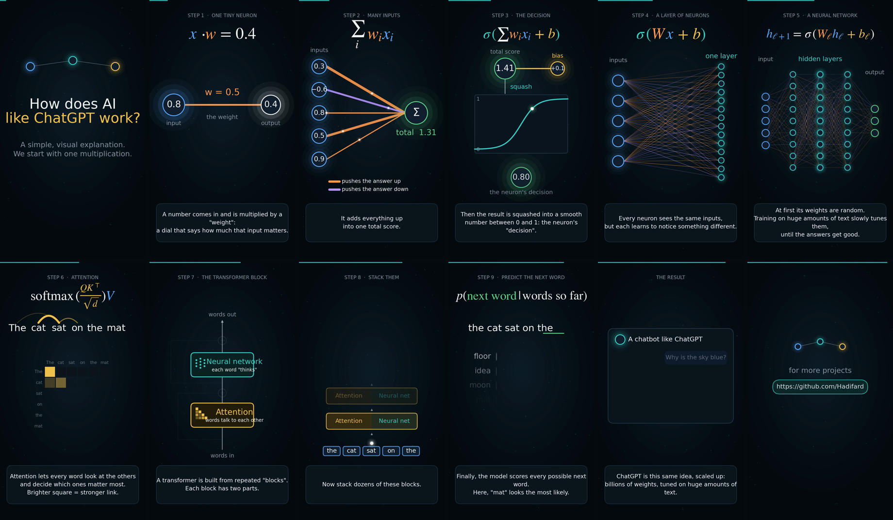

# AI, explained visually

**From one multiplication to ChatGPT, in about 80 seconds, for people who know nothing about AI.**

A short vertical explainer video (720 × 1280) that builds a modern language model one idea at a time:
a single neuron, a layer, a neural network, attention, the transformer block, and finally next-word prediction.
Every step has a plain-English caption, and the whole video is generated from code.

<p align="center">
  
</p>

[Watch the full-quality video (MP4)](assets/AI_explained_for_beginners.mp4)

<p align="center">
  
</p>

## The story, step by step

| # | Step | The idea in plain words | Formula on screen |
|---|------|-------------------------|-------------------|
| 1 | One tiny neuron | A number comes in and is multiplied by a *weight*, a dial for how much it matters. | `x · w = 0.4` |
| 2 | Many inputs | Each input has its own weight. Some push the answer up, some push it down. The neuron adds them up. | `Σ wᵢ xᵢ` |
| 3 | The decision | A small nudge (*bias*) is added, then the total is squashed into a number between 0 and 1. | `σ(Σ wᵢ xᵢ + b)` |
| 4 | A layer | Many neurons side by side, each learning to notice something different. | `σ(Wx + b)` |
| 5 | A neural network | Layers stacked on layers. Weights start random and are tuned by training on lots of data. | `hₗ₊₁ = σ(Wₗ hₗ + bₗ)` |
| 6 | Attention | Every word looks at the other words and decides which matter most ("who sat? the cat"). | `softmax(QKᵀ/√d) V` |
| 7 | The transformer block | Attention (words talk to each other) + a neural network (each word "thinks"), with skip paths. | `h = x + Attn(x)`, `y = h + MLP(h)` |
| 8 | Stack them | Dozens of blocks on top of each other understand the sentence more deeply. | |
| 9 | Predict the next word | The model scores every possible next word, picks one, and repeats, word by word. | `p(next word ∣ words so far)` |
| 10 | The result | A chatbot such as ChatGPT is this same idea, scaled up enormously. | |

## Files

```
ai-explained-visually/
├── assets/
│   ├── AI_explained_for_beginners.mp4   # the video (720x1280, 30 fps, ~80 s)
│   ├── AI_explained_for_beginners.gif   # lighter GIF version (400 px wide, 10 fps)
│   └── overview.png                     # contact sheet of the whole video
├── src/
│   └── render.py                        # all scenes, drawn with matplotlib
├── build.py                             # renders the MP4 and makes the GIF
├── requirements.txt
├── LICENSE
└── README.md
```

## Build it yourself

You need Python 3.9+ and [ffmpeg](https://ffmpeg.org) on your `PATH`.

```bash
pip install -r requirements.txt

python build.py                # full video + GIF into ./output
python build.py --frames 90    # quick preview: first 3 seconds only
python build.py --no-gif       # video only
```

A full render takes several minutes on one CPU core (the neural-network scenes draw hundreds of lines per frame).

To look at single frames without rendering a video:

```bash
python src/render.py test 5.0 20.0 40.0   # saves PNGs into ./test_frames
```

## Make it your own

Everything lives in `src/render.py`:

* **Captions:** each `scene*` function ends with a `caption(t, a, [(start, end, text), ...])` call. Edit the text or the times.
* **Colours:** the constants at the top of the file (`BLUE`, `ORANGE`, `TEAL`, `GOLD`, ...).
* **Timing and order:** the `SCENES` list and `DUR` near the bottom.
* **Size and frame rate:** `W`, `H`, `FPS` at the top.
* **A new scene:** write `def my_scene(t, a)`, where `t` is seconds since the scene started and `a` is the fade factor. Draw with the helpers (`node`, `line`, `curve`, `text`, `rich`, `box`, `dot`) and add it to `SCENES`.

## Notes

* This is a teaching simplification. Real models have far more parts (embeddings, positional information, many attention heads, normalization, and so on), and the numbers on screen are illustrative.
* The video is silent and the captions are in English.
* ChatGPT is mentioned only as a well-known example of a chatbot. This project is not affiliated with OpenAI.


## License

MIT, see [LICENSE](LICENSE).

---

For more projects: https://github.com/Hadifard
